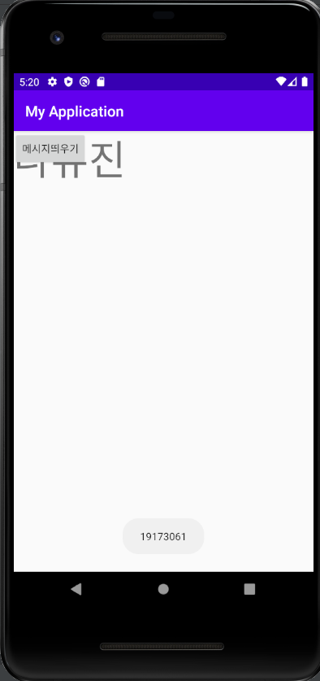
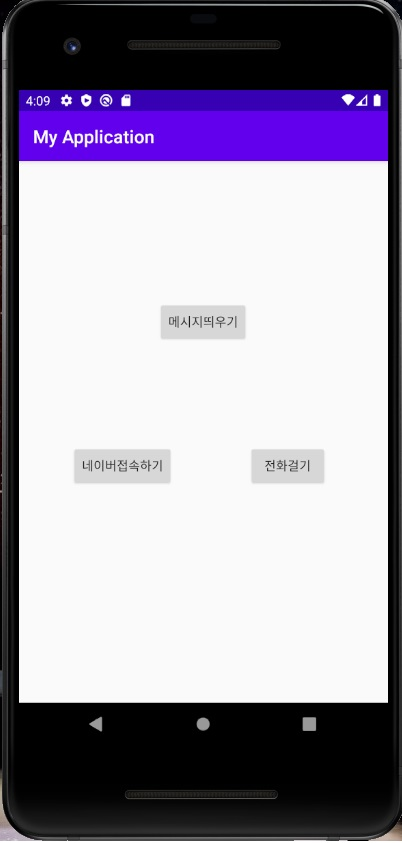

# 19173061 나유진
## 1주차 과제

## 2주차 과제
</img>

## 3주차 과제
</img>
</img>
</img>

## 4주차 과제
단어를 빨리 외울수있게해주는 앱
외국어를 공부하는 사람들에게 단어를 빨리 외울 수 있게 해주는 앱이다.
단어를 외우다보면 너무 시간이 오래걸려서 시간효율이 떨어지기때문에
타이머를 맞춰서 시간내에 단어를 외울수있게 활용한다.
자신의 통장을 자동이체 설정을 하고 시간내에 목표치에 도달하지 못하면 특정금액씩 빠져나가서
목표치에 도달할시에만 금액을 되찾을수있게 해놓는 앱이다.

## 7주차 과제
</img>
</img>

## 9주차 과제
</img>
</img>
</img>
</img>
public class MainActivity extends AppCompatActivity {

    ScrollView scrollView;
    ImageView imageView;
    BitmapDrawable bitmap;
    String Width;
    String Height;

    @Override
    protected void onCreate(Bundle savedInstanceState) {
        super.onCreate(savedInstanceState);
        setContentView(R.layout.activity_main);

        scrollView = findViewById(R.id.verScrollView);
        imageView = findViewById(R.id.imageView);
        scrollView.setHorizontalScrollBarEnabled(true);

        Resources res = getResources();
        bitmap = (BitmapDrawable) res.getDrawable(R.drawable.image01);
        int bitmapWidth = bitmap.getIntrinsicWidth();
        int bitmapHeight = bitmap.getIntrinsicHeight();
        Width = Integer.toString(bitmapWidth);
        Height = Integer.toString(bitmapWidth);

        imageView.setImageDrawable(bitmap);
        imageView.getLayoutParams().width = bitmapWidth;
        imageView.getLayoutParams().height = bitmapHeight;

    }
    public void btnClicked(View v)
    {
        changeImage();
    }
    public void btnWClicked(View v)
    {
        Toast.makeText(this,Width,Toast.LENGTH_LONG).show();
    }
    public void btnHClicked(View v)
    {
        Toast.makeText(this,Height,Toast.LENGTH_LONG).show();
    }
    private void changeImage()
    {
        Resources res = getResources();
        bitmap = (BitmapDrawable) res.getDrawable(R.drawable.image02);
        int bitmapWidth = bitmap.getIntrinsicWidth();
        int bitmapHeight = bitmap.getIntrinsicHeight();
        Width = Integer.toString(bitmapWidth);
        Height = Integer.toString(bitmapWidth);

        imageView.setImageDrawable(bitmap);
        imageView.getLayoutParams().width = bitmapWidth;
        imageView.getLayoutParams().height = bitmapHeight;

    }
}
